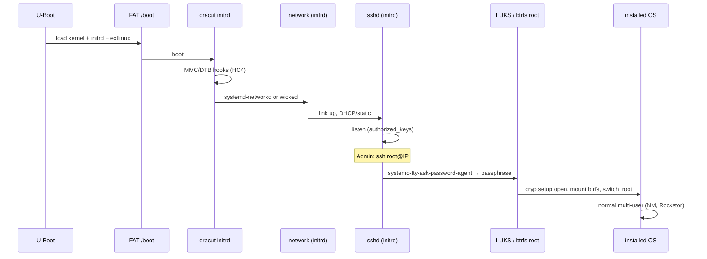

# ODROID-HC4 encrypted root (LUKS) — design notes

Branch: **`odroid-hc4-encrypt-root`** (PRs target this branch until merged to `odroid-hc4`).

## Goal

Ship a `Tumbleweed.OdroidHC4` OEM `.raw` image where:

- **FAT `/boot`** (partition 1) stays **unencrypted**: U-Boot, extlinux, kernel, DTB, initrd.
- **Root** (partition 3, btrfs + Snapper) sits inside **LUKS2**.
- At **early boot**, the user is prompted for the **LUKS passphrase** (decryption) before the system pivots to the real root.

HC4 does **not** use GRUB cryptodisk on the boot path (U-Boot → extlinux → kernel + dracut initrd). Passphrase entry belongs in **dracut** (initrd), not in U-Boot/extlinux configuration.

References:

- [KIWI NG — disk setup for LUKS](https://osinside.github.io/kiwi/working_with_images/disk_setup_for_luks.html)
- [KIWI NG — customize boot / `rd.kiwi.oem.luks.*`](https://osinside.github.io/kiwi/concept_and_workflow/customize_the_boot_process.html)
- Existing x86_64 example (GRUB + PBKDF2): `rockstor.kiwi` `Leap16.0.x86_64` preferences (commented `luks`, `luksformat`).

## Current HC4 boot stack (unencrypted root)

| Layer | Role today |
|--------|------------|
| `rockstor.kiwi` `Tumbleweed.OdroidHC4` | MBR, `bootpartition="true"`, btrfs root, `editbootinstall_odroid_hc4.sh` |
| `editbootinstall_odroid_hc4.sh` | Recreate FAT `/boot`, patch initrd + extlinux, write Armbian U-Boot |
| `scripts/patch-hc4-initrd.sh` | HC4 MMC hooks, disable kiwi-repart, optional oem-resize flags |
| `scripts/patch-hc4-extlinux-root.sh` | `root=LABEL=ROOT` on **partition 3** |
| `config.sh` (OdroidHC4) | `hostonly=no`, MMC drivers in dracut |
| `pre_disk_sync.sh` | fstab `LABEL=ROOT` / `BOOT` / `SWAP` |
| `rockstor-hc4-expand-root.service` | Grow MBR p3 + btrfs (LUKS-aware work **not** implemented yet) |

Kernel cmdline (installer image): `console=ttyAML0,115200n8`, `plymouth.enable=0`, MMC `rd.driver.pre=*`.

## Recommended LUKS model for HC4

Use KIWI **partial encryption** (matches existing layout):

```xml
<type … bootpartition="true" … luks="…" luks_version="luks2">
  <luksformat>
    <option name="--pbkdf" value="PBKDF2"/>
  </luksformat>
  …
</type>
```

- `bootpartition="true"`: keep **512 MiB FAT `BOOT`**; encrypt **root** only ([KIWI LUKS docs](https://osinside.github.io/kiwi/working_with_images/disk_setup_for_luks.html)).
- `cryptsetup` is already in `rockstor.kiwi` image packages.
- **PBKDF2** matters mainly for GRUB cryptodisk on x86; HC4 can still use LUKS2 defaults, but aligning with the existing x86_64 profile avoids surprises if tooling assumes PBKDF2.

### Passphrase: build-time vs runtime

- The `luks="…"` attribute in `rockstor.kiwi` is **security-sensitive** (master passphrase baked at image build).
- For published images, plan **OEM first-boot re-encryption** so the shipped passphrase is not the long-term secret:
  - `rd.kiwi.oem.luks.reencrypt` — reencrypt when LUKS header matches the built image ([KIWI boot customization](https://osinside.github.io/kiwi/concept_and_workflow/customize_the_boot_process.html)).
  - Optionally `rd.kiwi.oem.luks.reencrypt_randompass` + later key escrow (TPM not available on HC4; user must set a new passphrase during/after reencrypt).
- Prefer `luks="file:///path/to/keyfile"` in **private build environments**, not committed XML.

### Where the user types the passphrase

| Approach | HC4 fit |
|----------|---------|
| GRUB cryptodisk | **No** — not the HC4 boot chain |
| **dracut `crypt` module** in initrd | **Yes** — unlock before `switch_root` |
| systemd mount only (late) | KIWI doc wording for `bootpartition="true"`; on openSUSE dracut still normally handles LUKS in initrd when `crypttab` / `rd.luks.*` is present |

**Initrd requirements:**

1. Include dracut **`crypt`** module (and dependencies: `cryptsetup`, `dm-crypt`).
2. Keep **`console=ttyAML0,115200n8`** (and `console=tty0`) so `systemd-ask-password` / dracut prompt works on **serial and HDMI**.
3. Consider `rd.systemd.show_status=1` during bring-up for visible prompts on tty0.
4. Extend `config.sh` `rockstor-odroid-hc4.conf` or `patch-hc4-initrd.sh` to force `add_dracutmodules+=" crypt "` if hostonly/no-crypt regressions appear.

**FAT `/boot` content:** unchanged role — only store **public** boot artifacts. Do **not** put LUKS keyfiles on FAT in production.

## `rockstor.kiwi` changes (HC4 profile)

On `Tumbleweed.OdroidHC4` `<type …>`:

1. Add `luks` + `luks_version="luks2"` (+ optional `<luksformat>` PBKDF2).
2. Add OEM kernel cmdline flags for reencrypt on first deployment, e.g. extend `kernelcmdline`:
   - `rd.kiwi.oem.luks.reencrypt` (and document user passphrase change flow).
3. Review **`oem-resize-once`**: conflicts with LUKS grow semantics; may need to stay disabled (as today via `patch-hc4-initrd.sh`) and rely on **`rockstor-hc4-expand-root`** after LUKS resize support exists.
4. Optional: profile suffix in version string (`5.5.3-0-luks`) for release naming.

Mirror comments from x86_64 block into HC4 preferences so maintainers see PBKDF2 / passphrase warnings in one place.

## Boot partition / extlinux (not “ask in extlinux”)

extlinux **cannot** unlock LUKS. It only loads kernel + initrd and passes **kernel command line**.

Today `patch-hc4-extlinux-root.sh` sets `root=LABEL=ROOT` by `blkid` on **partition 3**. With LUKS, partition 3 is **`crypto_LUKS`**; **LABEL=ROOT** is on the **opened** device / btrfs inside the mapper.

**Required updates:**

1. **`patch-hc4-extlinux-root.sh`**
   - If p3 is LUKS: set `rd.luks.uuid=<LUKS UUID>` (or `rd.luks.name=…`) on the `append` line.
   - Keep `root=` as btrfs UUID/LABEL **inside** the unlocked volume (as KIWI writes in `/config.bootoptions` / image root).
   - Do not point `root=` at the raw LUKS partition device.

2. **`scripts/validate-hc4-extlinux-root.sh`**
   - Validate LUKS UUID + inner root spec against loop-mounted image.

3. **`editbootinstall_odroid_hc4.sh`**
   - No passphrase UI here; ensure patched initrd on FAT is the **same** dracut image that contains `crypt` module.

4. **README** (`Tumbleweed.OdroidHC4`): document serial/HDMI prompt at boot, build passphrase vs post-install reencrypt, flash steps unchanged (`.raw.xz`).

## `config.sh` / dracut / initrd patch

| File | LUKS-related work |
|------|-------------------|
| `config.sh` | `add_dracutmodules+=" crypt "` for OdroidHC4; ensure `/etc/crypttab` generation by KIWI is not stripped |
| `scripts/patch-hc4-initrd.sh` | Verify `crypt` hooks present after unpack; optional `pre-mount` sanity; keep MMC hooks **before** crypt open |
| `pre_disk_sync.sh` | fstab: root on `/dev/mapper/…` or UUID of btrfs; confirm KIWI LUKS layout vs `LABEL=ROOT` |

## First-boot expand-root + LUKS

`rockstor-hc4-expand-root-partition.sh` today:

1. Grows MBR partition 3.
2. `btrfs filesystem resize max`.

With LUKS it must become:

1. Grow partition 3 (`parted`).
2. **`cryptsetup resize`** on the LUKS device (mapper).
3. **`btrfs filesystem resize max`** on the decrypted mapper.

Order and online/offline constraints must be tested on real HC4 hardware.

## OEM installer / Rockstor workflow

- Installer still dumps OEM image to target disk; LUKS header travels with the image.
- **Rockstor** on encrypted root: confirm Web UI and btrfs tools see `/` on mapper; Snapper subvol path `@/.snapshots/1/snapshot` unchanged.
- **Swap** (p2): typically **unencrypted** in partial-LUKS layouts; document threat model.

## Validation checklist

- [ ] `kiwi-ng` schema load for `Tumbleweed.OdroidHC4` with LUKS attrs (x86_64 cloud agent: schema only).
- [ ] Full build on arm64 + `validate-hc4-raw-uboot.sh` / extlinux validator (LUKS-aware).
- [ ] Boot HC4: prompt on **ttyAML0** and **HDMI**; successful unlock and `switch_root`.
- [ ] Reboot: same passphrase; marker for expand-root + resize inside LUKS.
- [ ] Flash script: no change expected (bit-copy `.raw`).

## Suggested implementation order (PRs on `odroid-hc4-encrypt-root`)

1. `rockstor.kiwi` + README + private build keyfile convention.
2. `config.sh` / dracut `crypt` module.
3. extlinux patch + validate scripts (LUKS UUID).
4. `patch-hc4-initrd.sh` / cmdline for reencrypt + serial console prompts.
5. `rockstor-hc4-expand-root-partition.sh` LUKS resize.
6. Experimental GitHub release notes (draft / dev disclaimer).

## Risks / open questions

- **Fixed passphrase in XML** if reencrypt is skipped — unacceptable for production; treat as dev-only until reencrypt flow is verified.
- **Dracut hostonly**: already `hostonly=no` on HC4; keep it for LUKS + MMC modules in initrd on FAT.
- **Performance**: LUKS on SD/eMMC; acceptable for NAS use but worth noting in release text.
- **Kiwi + `oem-resize-once`**: keep disabled on HC4; coordinate with LUKS grow.

## Comparison: Armbian MMGen tutorial (forum topic 15618)

Source: [Full root filesystem encryption on an Armbian system](https://forum.armbian.com/topic/15618-full-root-filesystem-encryption-on-an-armbian-system-new-replaces-2017-tutorial-on-this-topic/) (MMGen, 2020; automated sibling: [mmgen-geek-tools](https://github.com/mmgen/mmgen-geek-tools)). **Odroid HC4** is listed among boards the author tested (Debian Buster / Ubuntu Focal mainline).

### What the tutorial does

| Step | Armbian MMGen | Rockstor HC4 kiwi image today |
|------|----------------|-------------------------------|
| When | On a **running Armbian** host; blank SD/eMMC as target | **At image build** (`kiwi-ng` + `editbootinstall_odroid_hc4.sh`) |
| Bootloader | `dd` first N sectors from stock `.img` to target | Armbian **`u-boot.bin`** @ LBA 0 / sector 1 on `.raw` |
| Boot partition | **ext4** ~400 MiB, label `CRYPTO_BOOT`, `/boot` contents copied | **FAT32** 512 MiB `BOOT`, kernel/initrd/dtb/extlinux on FAT |
| Root | **LUKS on p2**, `ext4` on `/dev/mapper/rootfs` | **btrfs** (+ Snapper) on p3, unencrypted |
| Boot config | `armbianEnv.txt` **or** extlinux `root=/dev/mapper/rootfs` | extlinux `root=LABEL=ROOT` (patched post-build) |
| Initramfs | **Debian `initramfs-tools`** + `update-initramfs` | **dracut** (kiwi), patched by `patch-hc4-initrd.sh` |
| Unlock | `crypttab` + **`cryptsetup-initramfs`**; optional **`dropbear-initramfs`** (SSH :2222, `cryptroot-unlock`) | Not implemented; target **dracut `crypt`** + optional network unlock via dracut/network (different packages) |
| Resize | `touch .no_rootfs_resize` on Armbian | `rockstor-hc4-expand-root.service` grows p3 + btrfs |

### Can we apply it to our HC4 **image build**?

**Same goal, different implementation — do not run the tutorial verbatim on a Rockstor image.**

- **Applies in principle:** unencrypted boot + LUKS root; unlock in **initrd** before real root; extlinux only passes `root=` to the mapper (or btrfs inside LUKS after unlock). HC4 being on MMGen’s board list supports that **U-Boot + extlinux + LUKS mapper** works on this hardware.
- **Does not apply step-for-step:**
  - OS is **openSUSE Tumbleweed**, not Armbian — no `apt`, no `initramfs-tools`, no `armbianEnv.txt`, no `dropbear-initramfs` without porting to dracut/initrd.
  - Partition layout is **MBR p1 BOOT / p2 SWAP / p3 ROOT**, not two-partition Armbian layout; root is **btrfs** with `@/.snapshots/1/snapshot`, not ext4.
  - Our initrd is **dracut** on FAT `/boot`; Armbian stores initrd under ext4 `/boot` and regenerates with `update-initramfs`.
  - Build-time path should use **KIWI `luks=` + `bootpartition="true"`** ([design above](#recommended-luks-model-for-hc4)), not loop-mount + manual `rsync` from an Armbian `.img`.

**Equivalent mapping (what to implement in this repo instead of MMGen steps):**

| MMGen / Armbian | Rockstor HC4 encrypt-root branch |
|-----------------|----------------------------------|
| `cryptsetup luksFormat` + `luksOpen` on root partition | KIWI `luks` / `luks_version` on `Tumbleweed.OdroidHC4` |
| `etc/crypttab` (`initramfs,luks`) | Generated by kiwi into image; ensure dracut **`crypt`** includes it |
| extlinux `root=/dev/mapper/rootfs` | `rd.luks.uuid=…` + inner `root=` / `rootflags=subvol=…` in extlinux **append** (update `patch-hc4-extlinux-root.sh`) |
| `initramfs.conf` `IP=` / `DEVICE=` for SSH unlock | dracut **network** + optional **dropbear** in initrd (non-trivial on openSUSE; serial `ttyAML0` prompt is simpler first milestone) |
| `dropbear-initramfs` + `authorized_keys` | Optional later; not in current kiwi packages |
| `.no_rootfs_resize` | Disable conflicting kiwi repart (already); extend **`rockstor-hc4-expand-root`** for `cryptsetup resize` |

**Optional third path (not kiwi-native):** run a **post-flash migration** script on a live HC4 (inspired by MMGen or `mmgen-geek-tools`) that repartitions, LUKS-formats p3, rsyncs btrfs, rewrites extlinux/fstab/crypttab, and runs **`dracut -f`** — similar to `scripts/migrate-hc4-disk-armbian-layout.sh` scope. Heavier and riskier than baking LUKS in kiwi, but closest to the forum workflow.

**Recommendation:** Prefer **KIWI LUKS + dracut crypt** for the installer `.raw` on `odroid-hc4-encrypt-root`; treat the Armbian tutorial as validation that **HC4 + extlinux + LUKS mapper** is feasible, and as a reference for **remote unlock** (dropbear) if we add it later on openSUSE/dracut.

## SSH unlock LUKS root, then normal boot (primary goal)

**Target behaviour:** HC4 powers on headless → **Ethernet is up in initrd** → admin **`ssh`** into early userspace → enters **LUKS passphrase** → initrd opens root, **`switch_root`** → normal openSUSE/Rockstor boots (NetworkManager, `sshd` on the installed system, Rockstor UI).

Armbian MMGen uses **Dropbear** on port **2222** and `cryptroot-unlock`. On **openSUSE Tumbleweed + dracut**, the practical equivalent is **`dracut-sshd`** (OpenSSH in initrd) plus **network in initrd**, then **`systemd-tty-ask-password-agent`** over SSH ([dracut-sshd](https://github.com/gsauthof/dracut-sshd), [openSUSE forum discussion](https://forums.opensuse.org/t/remote-unlock-ssh-an-encrypted-installation/147303)). Package **`dracut-sshd`** is published for openSUSE (see project README / OBS).

Do **not** port `dropbear-initramfs` unless dracut-sshd proves unusable on aarch64 HC4 (larger initrd, different key handling).

### Boot sequence (with SSH unlock)



FAT **`/boot` stays unencrypted** (kernel, initrd, extlinux, DTB). Only initrd contents and kernel cmdline change.

### Implementation phases (repo updates on `odroid-hc4-encrypt-root`)

#### Phase A — LUKS root (blocking for SSH unlock)

Without encrypted root, SSH unlock has nothing to do.

| Step | Where | Action |
|------|--------|--------|
| A1 | `rockstor.kiwi` `Tumbleweed.OdroidHC4` | `luks` + `luks_version="luks2"`, `bootpartition="true"`; build passphrase via private keyfile, not git |
| A2 | `config.sh` (OdroidHC4) | `add_dracutmodules+=" crypt "` in `rockstor-odroid-hc4.conf` |
| A3 | `patch-hc4-extlinux-root.sh` | LUKS: add `rd.luks.uuid=…`; keep btrfs `root=` / `rootflags=subvol=@/.snapshots/1/snapshot` |
| A4 | `rockstor.kiwi` `kernelcmdline` | `rd.neednet=1` (see Phase B); keep `console=ttyAML0,115200n8` for local fallback |
| A5 | First deploy | Consider `rd.kiwi.oem.luks.reencrypt` so flashable image is not tied to build passphrase forever |

Verify **local** unlock (serial/HDMI password prompt) before SSH.

#### Phase B — Network inside initrd (blocking for SSH)

Initrd must bring up **HC4 Ethernet** before or while LUKS waits. Installed OS uses **NetworkManager**; initrd should **not** rely on NM unless you explicitly add dracut’s NM path (heavier, forum reports double-IP quirks).

| Step | Where | Action |
|------|--------|--------|
| B1 | `rockstor.kiwi` packages | Add **`dracut-network`**; add **`systemd-networkd`** (or use **wicked** + dracut `network` module per [openSUSE dracut networking](https://forums.opensuse.org/t/remote-unlock-ssh-an-encrypted-installation/147303)) |
| B2 | `config.sh` | `add_dracutmodules+=" systemd-networkd "` (or wicked/network); `install_items+=" /etc/systemd/network/50-rockstor-initrd.network "` |
| B3 | Image root file | `/etc/systemd/network/50-rockstor-initrd.network` — match HC4 NIC (`Name=en*` / `end*` / `eth0` from `ip link` on hardware) |
| B4 | `rockstor.kiwi` `kernelcmdline` | `rd.neednet=1`; optional static `ip=…` or DHCP via networkd file (avoid `ip=dhcp` unless using dracut backend that supports it) |
| B5 | `config.sh` dracut | Include **Ethernet driver modules** for meson (e.g. `dwmac_meson`, `stmmac`) if not pulled in automatically |
| B6 | `patch-hc4-initrd.sh` | After unpack/repack: sanity-check `etc/systemd/network/*`, `usr/sbin/sshd` present when Phase C enabled |

**Test:** `rd.break=pre-mount` (or `rd.shell`) from extlinux, confirm interface has IP in initrd on real HC4.

#### Phase C — SSH in initrd (`dracut-sshd`)

| Step | Where | Action |
|------|--------|--------|
| C1 | `rockstor.kiwi` | Package **`dracut-sshd`** (aarch64 Tumbleweed) |
| C2 | `config.sh` | Create `/etc/dracut-sshd/authorized_keys` from build-time placeholder or first-boot hook; document admin must install their **ed25519** public key before relying on SSH unlock |
| C3 | `config.sh` | Ensure dracut includes keys: `/etc/dracut-sshd/authorized_keys` (preferred over `/root/.ssh` during kiwi chroot) |
| C4 | `config.sh` | `add_dracutmodules+=" sshd "` if not auto-enabled; rebuild initrd during image build (`dracut -f` in chroot or trust kiwi regen) |
| C5 | `editbootinstall_odroid_hc4.sh` | Still run `patch-hc4-initrd.sh` on FAT `initrd` only if patches remain compatible with larger initrd (size check on FAT partition) |

**Admin workflow (runtime):**

```text
ssh -o StrictHostKeyChecking=accept-new root@<hc4-initrd-ip>
# in initrd shell:
systemd-tty-ask-password-agent
# enter LUKS passphrase; when prompts complete, SSH drops and machine continues boot
# after ~1–2 min, normal system:
ssh root@<hc4-ip>   # host keys differ from initrd; use installed system keys
```

Optional: document **initrd host keys** (regenerated per dracut-sshd policy) vs **installed** `sshd` keys.

Armbian’s **port 2222** is only needed to separate dropbear from production sshd; initrd-only **OpenSSH on 22** is usually fine because production `sshd` is not running until after `switch_root`.

#### Phase D — Normal boot after unlock

| Step | Where | Action |
|------|--------|--------|
| D1 | `/etc/crypttab` | KIWI-generated `luks` entry with `initramfs` option; fstab root on mapper or btrfs UUID inside LUKS |
| D2 | `pre_disk_sync.sh` | Align fstab/crypttab with mapper names KIWI uses |
| D3 | Installed `sshd` | Unchanged (`openssh` already in image); Rockstor services start as today |
| D4 | `rockstor-hc4-expand-root.service` | Extend for `cryptsetup resize` after partition grow |

No change to U-Boot or extlinux beyond **append** line (LUKS + net params).

#### Phase E — Validation on HC4 hardware

1. Flash encrypted `.raw`; set LUKS passphrase (reencrypt flow if used).
2. Install SSH public key in `/etc/dracut-sshd/authorized_keys` (first boot chroot or custom config overlay).
3. Rebuild initrd if keys added post-build: `dracut -f` and recopy to FAT `/boot` (or rebuild image).
4. Cold boot: ping/DHCP; SSH unlock; confirm Rockstor UI.
5. Reboot: repeat SSH unlock; confirm expand-root if unallocated space present.

### Mapping Armbian MMGen → this plan

| MMGen step | Our phase |
|------------|-----------|
| `cryptsetup luksFormat` / `crypttab` | A (KIWI + crypttab) |
| `initramfs.conf` `IP=` / `DEVICE=` | B (systemd-networkd + `.network`) |
| `dropbear-initramfs` + `authorized_keys` | C (`dracut-sshd` + `/etc/dracut-sshd/authorized_keys`) |
| `cryptroot-unlock` on SSH login | C (`systemd-tty-ask-password-agent`) |
| extlinux `root=/dev/mapper/rootfs` | A3 (`rd.luks.uuid` + btrfs `root=`) |

### Risks specific to SSH unlock

| Risk | Mitigation |
|------|------------|
| No network in initrd | Phase B; test with `rd.break`; include meson NIC drivers |
| Initrd too large for FAT `/boot` | Monitor `initrd` size (sshd + network adds ~few MiB compressed); 512 MiB FAT is ample |
| Wrong NIC name in `.network` | Document HC4 interface name; optional udev match on MAC |
| Build-time LUKS passphrase in leaked `.raw` | `rd.kiwi.oem.luks.reencrypt` + user-chosen passphrase at first boot |
| Locked out | Keep **serial console** passphrase path (`ttyAML0`) |
| Wi-Fi unlock | Out of scope; HC4 NAS use case is **Ethernet** |

### Suggested PR order (SSH unlock track)

1. **A** — KIWI LUKS + dracut `crypt` + extlinux (local unlock).  
2. **B** — initrd network on HC4.  
3. **C** — `dracut-sshd` + keys + README operator guide.  
4. **D** — expand-root + LUKS resize.  
5. **E** — hardware test notes / optional `validate-hc4-initrd-ssh.sh` (grep `lsinitrd` for sshd + network + crypt).
